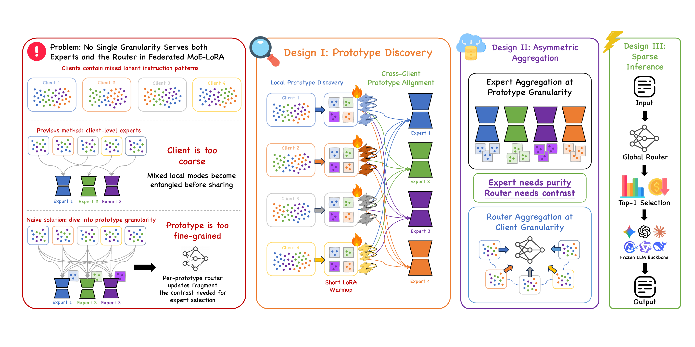

<div align="center">

# 🧶 FedWeave

### Rethinking the Unit of Specialization in Heterogeneous Federated MoE-LoRA

<p>
  
  
  
  
</p>

<p>
  <a href="#-overview">Overview</a> •
  <a href="#-quick-start">Quick Start</a> •
  <a href="#-reproducing-the-paper">Reproduction</a> •
  <a href="#-evaluation">Evaluation</a> •
  <a href="#-citation">Citation</a>
</p>

</div>

---

## ✨ Overview

**FedWeave** is a federated MoE-LoRA framework for clients whose local data may contain multiple latent tasks. Instead of treating each client as one specialization unit, FedWeave discovers pattern-coherent local buckets, aligns them across clients, and aggregates expert updates at the prototype level.

The key design is an **asymmetric aggregation strategy**:

| 🧩 Component | What it needs | FedWeave's design |
|---|---|---|
| **LoRA experts** | Pure, pattern-coherent updates | Prototype-level aggregation across aligned local buckets |
| **Router** | Mixed observations for expert comparison | Continuous client-level optimization over interleaved buckets |
| **Inference** | Efficient conditional adaptation | Learned soft or sparse top-*k* expert routing |

> **Repository scope**
>
> This release contains only the FedWeave implementation: data construction, prototype discovery, federated training, checkpoint evaluation, and reproducibility launchers. Implementations of comparison methods are intentionally excluded.

## 🧭 Method at a glance

<p align="center">
  
</p>

<p align="center">
  <em>
    FedWeave discovers and aligns client-local prototypes, aggregates experts at prototype
    granularity, trains the router along complete client trajectories, and supports sparse inference.
  </em>
</p>

<div align="center">

| Unsupervised discovery | Asymmetric aggregation | Conditional inference |
|:---:|:---:|:---:|
| Find coherent local patterns without task labels | Keep experts pure while giving routers contrast | Combine only the experts useful for each example |

</div>

## 🚀 Quick Start

### 1. Create an environment

Python 3.10 or newer and a CUDA-capable PyTorch installation are recommended.

```bash
git clone <your-fedweave-repository-url>
cd FedWeave

python3 -m venv .venv
source .venv/bin/activate
pip install --upgrade pip
pip install -r requirements.txt
```

<details>
<summary><strong>Optional: enable SwanLab experiment tracking</strong></summary>

SwanLab is disabled by default and is not required for training or evaluation.

```bash
pip install -r requirements-optional.txt
USE_SWANLAB=true bash scripts/train/fedweave.sh --gpu 0
```

</details>

### 2. Prepare model access

The default backbone is [`meta-llama/Llama-3.2-3B`](https://huggingface.co/meta-llama/Llama-3.2-3B), which may require accepting its Hugging Face license. The second paper backbone is [`google/gemma-2-2b`](https://huggingface.co/google/gemma-2-2b).

Datasets are downloaded and processed automatically on the first run.

### 3. Train FedWeave

```bash
bash scripts/train/fedweave.sh --gpu 0
```

Outputs are written to:

```text
outputs/fedweave/
└── alpha_0p3/
    └── seed_42/
        ├── checkpoints/
        ├── prototype_discovery.json
        ├── routing_priors.json
        └── training_summary.json
```

### 4. Evaluate a checkpoint

```bash
SPLIT=both bash scripts/eval/predict.sh \
  --checkpoint outputs/fedweave/alpha_0p3/seed_42/checkpoints/best_val_loss.pt \
  --gpu 0
```

## 🧪 Reproducing the paper

### Experimental protocol

| Setting | Paper configuration |
|---|---|
| Backbones | Llama-3.2-3B, Gemma-2-2B |
| Tasks | CoEdIT, GSM8K, TweetEval-Sentiment, ARC-Challenge |
| Clients | 20 |
| Main Dirichlet α | 0.3 |
| Heterogeneity sweep | 0.1, 0.3, 0.5 |
| Reporting seeds | 42, 43, 44 |
| Maximum sequence length | 512 |
| Decoding | Greedy |

The complete dataset identifiers, source splits, sample counts, partition policy, and generation budgets are recorded in [`data/dataset_manifest.json`](data/dataset_manifest.json).

### Main three-seed result

```bash
SEED=42,43,44 ALPHA=0.3 \
  bash scripts/train/fedweave.sh --gpu 0
```

### Heterogeneity sweep

```bash
SEED=42,43,44 ALPHA=0.1,0.3,0.5 \
  bash scripts/train/fedweave.sh --gpu 0
```

### Backbone launcher

```bash
# Llama-3.2-3B
BACKBONE=llama bash scripts/bench/reproduce.sh --gpu 0

# Gemma-2-2B
BACKBONE=gemma bash scripts/bench/reproduce.sh --gpu 0
```

<details>
<summary><strong>Useful configuration overrides</strong></summary>

Every launcher option can be overridden with an environment variable.

```bash
# Change the model
MODEL_NAME=google/gemma-2-2b \
  bash scripts/train/fedweave.sh --gpu 0

# Change the client population
NUM_CLIENTS=40 ALPHA=0.3 \
  bash scripts/train/fedweave.sh --gpu 0

# Prototype discovery ablation
LOCAL_CLUSTER_ALGORITHM=spectral \
PROTOTYPE_SIGNATURE_TYPE=lora_ab \
  bash scripts/train/fedweave.sh --gpu 0

# Router aggregation ablation
ROUTER_AGGREGATION_SCOPE=bucket \
  bash scripts/train/fedweave.sh --gpu 0
```

Run `bash scripts/train/fedweave.sh --help` for additional examples.

</details>

## 📊 Evaluation

### Evaluate all selected checkpoints

```bash
SPLIT=test bash scripts/eval/predict.sh \
  --checkpoint_root outputs/fedweave \
  --checkpoint_names best_val_loss.pt \
  --gpu 0
```

### Override inference routing

```bash
# Full soft routing
EVAL_ROUTING=soft bash scripts/eval/predict.sh \
  --checkpoint path/to/checkpoint.pt --gpu 0

# Sparse top-2 routing
EVAL_ROUTING=topk EVAL_TOP_K=2 bash scripts/eval/predict.sh \
  --checkpoint path/to/checkpoint.pt --gpu 0
```

### Re-score saved predictions

This does not reload the backbone model:

```bash
bash scripts/eval/metrics.sh \
  --predictions_jsonl \
  outputs/fedweave/alpha_0p3/seed_42/checkpoints/eval/fedweave_test_predictions.jsonl
```

## 🗂️ Repository structure

<details open>
<summary><strong>Click to expand or collapse</strong></summary>

```text
.
├── assets/
│   ├── fedweave_overview.png       # Main framework figure
│   ├── heterogeneity_trends.png    # Heterogeneity analysis
│   ├── routing_heatmap.png         # Task-expert routing analysis
│   └── sparse_routing_tradeoff.png # Sparse inference analysis
├── data/
│   └── dataset_manifest.json       # Exact datasets and sampling protocol
├── scripts/
│   ├── bench/
│   │   └── reproduce.sh            # Paper backbone/seed launcher
│   ├── eval/
│   │   ├── metrics.sh              # Re-score prediction JSONL
│   │   └── predict.sh              # Evaluate FedWeave checkpoints
│   └── train/
│       └── fedweave.sh             # Main training launcher
├── src/
│   ├── config.py                   # Typed experiment configuration
│   ├── data.py                     # Sampling and client partitioning
│   ├── discover.py                 # Standalone prototype discovery
│   ├── engine.py                   # Routing and mixture computation
│   ├── lora.py                     # Model, adapters, and routers
│   ├── metrics.py                  # Task-level evaluation metrics
│   ├── predict.py                  # Checkpoint evaluation
│   ├── state.py                    # Federated state and aggregation
│   └── train.py                    # End-to-end FedWeave training
└── tests/
    └── test_repository.py          # Syntax and release-scope checks
```

</details>

## 📜 Citation

If this work is useful in your research, please cite the arXiv paper. The identifier will be added after assignment.

```bibtex
@article{duan2026fedweave,
  title   = {FedWeave: Rethinking the Unit of Specialization in Heterogeneous Federated MoE-LoRA},
  author  = {Duan, Donghang and Zheng, Xu and Zhang, Lizong and Mu, Chong and Han, Meng},
  year    = {2026}
}
```

## 📄 License

FedWeave is released under the [MIT License](LICENSE).

---

<div align="center">
  <sub>Built for reproducible research in heterogeneous federated adaptation.</sub>
</div>
